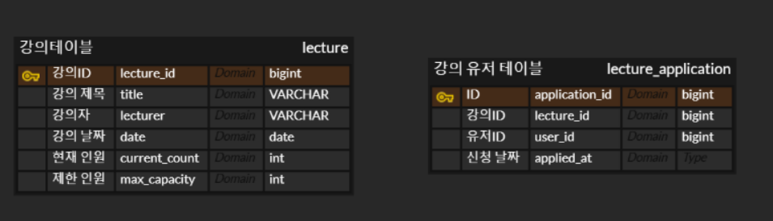
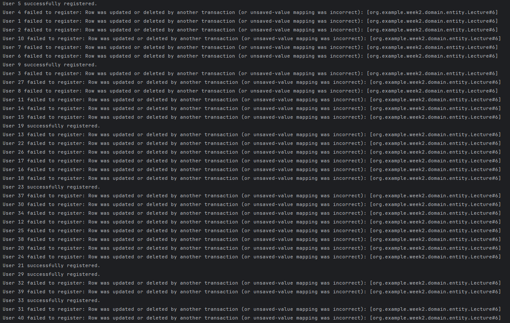
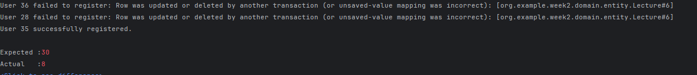
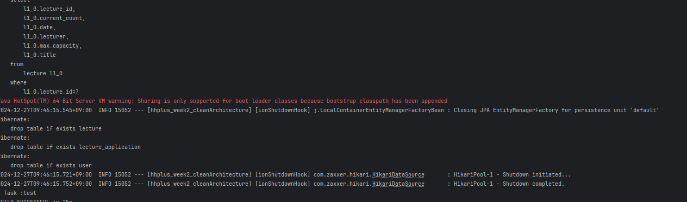

# hhplus_week2
**(아래 사항을 만족하지 않을 시 STEP 3, STEP4는 Fail처리 됩니다)**

- 아키텍처 준수를 위한 애플리케이션 패키지 설계
- 특강 도메인 테이블 설계 (ERD) 및 목록/신청 등 기본 기능 구현
- 각 기능에 대한 **단위 테스트** 작성

> **사용자 회원가입/로그인 기능은 구현하지 않습니다.**
>

### **`STEP 3`**

- 설계한 테이블에 대한 **ERD** 및 이유를 설명하는 **README** 작성
- 선착순 30명 이후의 신청자의 경우 실패하도록 개선
- 동시에 동일한 특강에 대해 40명이 신청했을 때, 30명만 성공하는 것을 검증하는 **통합 테스트** 작성

### **`STEP 4`**

- 같은 사용자가 동일한 특강에 대해 신청 성공하지 못하도록 개선
- 동일한 유저 정보로 같은 특강을 5번 신청했을 때, 1번만 성공하는 것을 검증하는 **통합 테스트** 작성
- ERD 구조

## ERD 구조

**lecture 테이블**
- 강의 정보를 담고 있는 테이블
- 기본적인 강의 정보와 제한 인원, 현재 신청인원을 칼럼 으로 갖고 있습니다
- 강의 신청을 하면 현재 신청인원을 + 하고 제한 인원과 비교해서 수강 인원을 관리 하게끔 했습니다.
- 제한 인원 수를 그때 그때 관리하여 확장 가능하게 구성했습니다.

**강의 유저 테이블**
- 강의와 해당 강의를 수강하는 유저 정보를 담고 있는 메핑테이블
- 강의 ID 와 유저 ID 로 수강 정보를 관리합니다.
- 강의 ID 와 유저 ID 조합으로 unique 값을 걸어 중복 신청을 방지해 테이터 무결성을 지키고자 했습니다

프로젝트 구조

--------
src

└── main

    └── java
        └── org.example.hhplus_week2_cleanarchitecture
            ├── application
            │   ├── service
            │   │   └── LectureService
            │   └── serviceImpl
            │       └── LectureServiceImpl
            ├── domain
            │   ├── entity
            │   │   ├── Lecture
            │   │   ├── LectureApplication
            │   │   └── User
            │   └── repository
            │       ├── LectureApplicationRepository
            │       └── LectureRepository
            ├── infrastructure
            │   ├── LectureApplicationJPARepository
            │   ├── LectureApplicationRepositoryImpl
            │   ├── LectureJPARepository
            │   └── LectureRepositoryImpl
            ├── interfaces.api
            │   ├── controller
            │   │   └── LectureController
            │   └── dto
            │       └── ApplyLectureRequest
            └── HhplusWeek2CleanArchitectureApplication

└── test

    └── java
        └── org.example.hhplus_week2_cleanarchitecture
            └── test
                ├── LectureConcurrencyTest
                └── HhplusWeek2CleanArchitectureApplicationTests

클린 아키텍처 와 DIP 개념을 살리기 위해 repositroy 인터페이스와 그의 구현체를 따로 구현해
db 와의 수정은 repository 구현체만 수정하면 될 수 있게 구성했습니다

**낙관적 락**

낙관적 락으로 동시성 테스트를 한 결과는 다음과 같습니다.

40개의 요청중 8개가 통과한것을 알 수 있습니다.

낙관적 락은 version으로 업데이트를 관리합니다 .
version 이 같을 시 업데이트 아닐 시 update 를 하지 않습니다
따라서 처음에 select 시 갖고 있는 version 정보가 주요합니다

동시에 select 를 업데이트 하기 전에 20개의 쓰레드가 했다면
20 개 모두 version 은 0으로 하나의 업데이트가 되면 19개는 업데이트가 실패하는 구조입니다.

따라서 40개요청 30개 성공의 경우
30개 이하의 성공은 보장할 수 있지만 정확히 30개의 성공을 위해선 재시도 로직을 짜야합니다.

따라서 저는 비관적 락으로 구성하도록 했습니다

**비관적 락**

비관적 락으로 테스트한 결과 통과한것을 알 수 있습니다.
비관적 락은  id 값으로 select를 했을 때 그 row 자체에 락을 거는 방식입니다
성능 면에서 안좋을 수 있으나 정확한 결과를 얻기 위해 비관적 락으로 구성했습니다.

## 테스트
docker compose 를 이용해 테스트를 구성했습니다.
- 절차
  1. docker desktop 과 같은 docker 엔진이 실행되고 있어야 합니다.
  2. docker compose 파일이 있는 위치 터미널에서 `` docker compose up -d`` 로 docker 를 실행시킵니다.